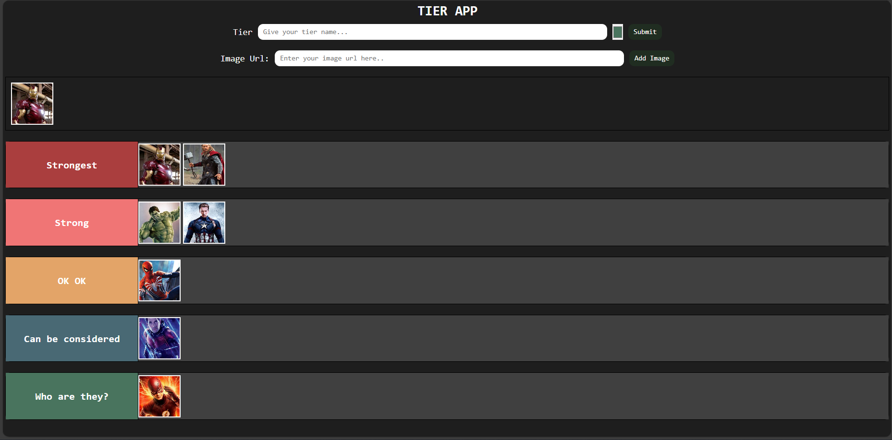

# Tier App

This is a Tier App that allows you to create and manage tier lists effortlessly. You can add images by inserting their links, create tier elements, and drag and drop images from the image container to any tier.

## Features

- Easily add images to the app by pasting their link.
- Create customizable tier elements to organize your images.
- Simply drag images from the container to any tier you've created.
- See the changes in your tier list as you drag and drop images.
- Delete and Edit Tier

## Screenshots

## Usage
- Add Image: Paste the URL of the image in the designated input field and click "Add Image".
- "Create Tier: Enter the tier name and click on "Submit" to create a new tier element.
- Drag and Drop: Drag any image from the container and drop it into any of the created tiers.
- Double click on image to send them back to image container
- Click on tier name and edit tier name
- Double click on tier heading (colored section) to delete tier.